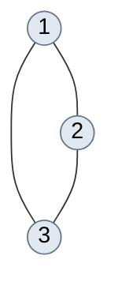
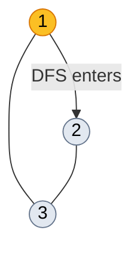
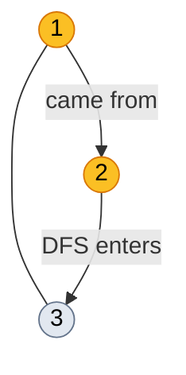
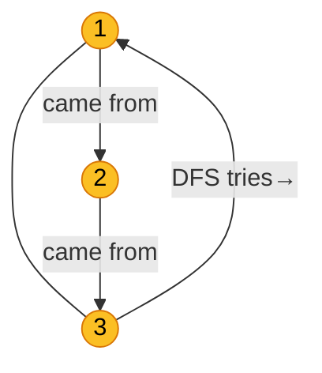
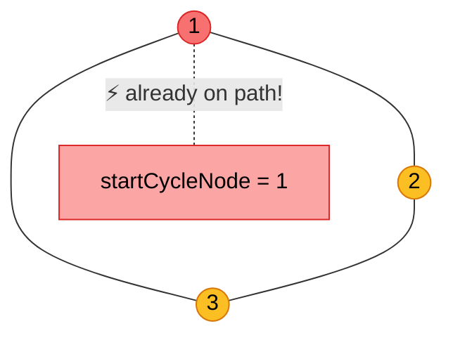
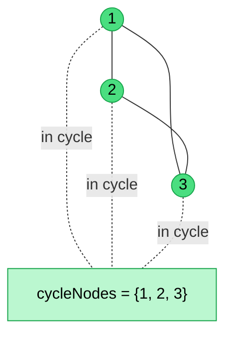

# 684. Redundant Connection

## Problem

Given a connected undirected graph of `n` nodes (labeled `1..n`) that was originally a **tree** with one extra edge added, find that redundant edge. If multiple valid answers exist, return the one that appears **last** in the input.

- Input: `edges[i] = [a, b]` — list of n edges (a tree has n-1 edges, so exactly 1 forms a cycle)
- Output: the last edge that can be removed to restore the tree

---

## Solutions

### DFS Iterative

**Core idea:** Build the full adjacency list, find all nodes that belong to the cycle via iterative DFS with path-tracking, then scan the edge list from the end and return the first edge whose **both endpoints** are in the cycle.

#### Two-phase algorithm

**Phase 1 — `GetCycleNodes`: find nodes on the cycle**

Uses iterative DFS with:
- `visitArray` — tracks state of each node:
  - `0` = unvisited
  - `1` = path-visited (currently on the active DFS path)
  - `2` = visited (fully backtracked)
- `pathSequence` — stack representing the current DFS path root→...→current
- `stack` — DFS worklist of `(parent, node)` pairs

**Phase 2 — find the redundant edge**

Scan `edges` from back to front. The first edge where both nodes are in `cycleNodes` is the answer.

---

#### Why push each node onto the stack twice?

In **recursive** DFS, each function call has two implicit events:
1. **Entry** (pre-order) — the moment you first arrive at a node
2. **Exit** (post-order) — the moment you finish all recursive calls and return

In **iterative** DFS, a single push/pop only handles one event. Pushing every node **twice** simulates both:

| Pop # | `anyNeighbours` | What happens |
|-------|-----------------|--------------|
| **1st** (entry) | `true` — unvisited neighbors exist | Push each neighbor twice; if node is already `pathVisited` → **cycle found**, stop. Otherwise mark node `pathVisited`, add to `pathSequence`. |
| **2nd** (exit) | `false` — all neighbors already `visited` | Remove node from `pathSequence`, mark node `visited` (backtrack). |

By the time the 2nd copy of a node is popped, all children pushed in its 1st pop have been fully processed (state = 2 = visited), so `anyNeighbours` is always `false` on the exit pop — unless a cycle is detected first, in which case we `break` before reaching those 2nd copies.

---

#### Step-by-step trace

Input: `edges = [[1,2],[1,3],[2,3]]`

**Initial graph (all nodes unvisited):**

Adjacency list:
- `1 → [2, 3]`
- `2 → [1, 3]`
- `3 → [1, 2]`

Initial stack: `[(0,1), (0,1)]` ← node 1 pushed twice, parent=0 (sentinel)

---

**Step 1 — Pop `(parent=0, node=1)` [1st copy — entry]**

Node 1 has unvisited neighbors: **2**, **3** → push `(1,2)×2`, `(1,3)×2`.
`visitArray[1] = 0` (not pathVisited) → mark **pathVisited**, add to `pathSequence`.

| Stack top→bottom | pathSequence (top = current) |
|------------------|------------------------------|
| `(1,2),(1,2),(1,3),(1,3),(0,1)` | `[1]` |

---

**Step 2 — Pop `(parent=1, node=2)` [1st copy — entry]**

Node 2's neighbors: **1** (= parent, skip), **3** (unvisited) → push `(2,3)×2`.
`visitArray[2] = 0` → mark **pathVisited**, add to `pathSequence`.

| Stack top→bottom | pathSequence |
|------------------|--------------|
| `(2,3),(2,3),(1,2),(1,3),(1,3),(0,1)` | `[2, 1]` |

---

**Step 3 — Pop `(parent=2, node=3)` [1st copy — entry]**

Node 3's neighbors: **1** (≠ parent, `visitArray[1]=1` ≠ `visitedNode=2` → **qualifies!**), **2** (= parent, skip).
Push `(3,1)×2`. `visitArray[3] = 0` → mark **pathVisited**, add to `pathSequence`.

> Note: neighbor 1 is `pathVisited` (state=1), not fully `visited` (state=2), so the condition
> `visitArray[neighbour] != visitedNode` is `true` and we still push it. This is what
> allows the cycle to be detected on the next pop.

| Stack top→bottom | pathSequence |
|------------------|--------------|
| `(3,1),(3,1),(2,3),(1,2),(1,3),(1,3),(0,1)` | `[3, 2, 1]` |

---

**Step 4 — Pop `(parent=3, node=1)` [1st copy — entry] → CYCLE DETECTED**

Node 1's neighbors: **2** (≠ parent=3, unvisited neighbors check), **3** (= parent, skip).
`anyNeighbours = true`.
`visitArray[1] = 1` (**pathVisited!**) → **cycle detected**, `startCycleNode = 1`, **break**.

`pathSequence = [3, 2, 1]` (top→bottom)

---

**Step 5 — Extract cycle nodes**

Iterate `pathSequence` top→bottom, collecting nodes until we reach `startCycleNode = 1` (inclusive):

---

**Step 6 — Scan edges from the end**

| i | edge | both in `cycleNodes`? | result |
|---|------|-----------------------|--------|
| 2 | `[2,3]` | ✅ 2 ∈ {1,2,3} and 3 ∈ {1,2,3} | **return `[2,3]`** |

---

#### Complexity

| | Complexity |
|---|---|
| **Time** | **O(V + E)** = O(n), since V = E = n |
| **Space** | **O(V + E)** = O(n), since V = E = n |

**Why O(V + E) time?**

DFS costs are **additive**, not multiplicative — vertices and edges are independent work items:

- **Building adjacency list:** each edge stored in both directions → O(E)
- **DFS traversal:**
  - Each vertex is pushed/popped at most **twice** (entry + exit) → O(V) total pops
  - Each edge `(u,v)` is examined once from `u`'s neighbor list and once from `v`'s → O(E) total edge scans
  - Combined: O(V + E)
- **Scanning edges for answer:** O(E)

**Total: O(V + E)**

This problem guarantees `edges.length == n`, so V = n nodes and E = n edges (tree has n−1 edges + 1 redundant = n total). Therefore O(V + E) = O(n + n) = **O(n)**.

**Why O(V + E) space?**

| Structure | Size |
|-----------|------|
| `adjList` | 2E entries (each edge stored in both directions) |
| DFS `stack` | at most O(V) entries (depth of DFS tree ≤ V) |
| `pathSequence` | at most O(V) nodes (one DFS path) |
| `visitArray` | V+1 entries |
| `cycleNodes` | at most O(V) nodes |
